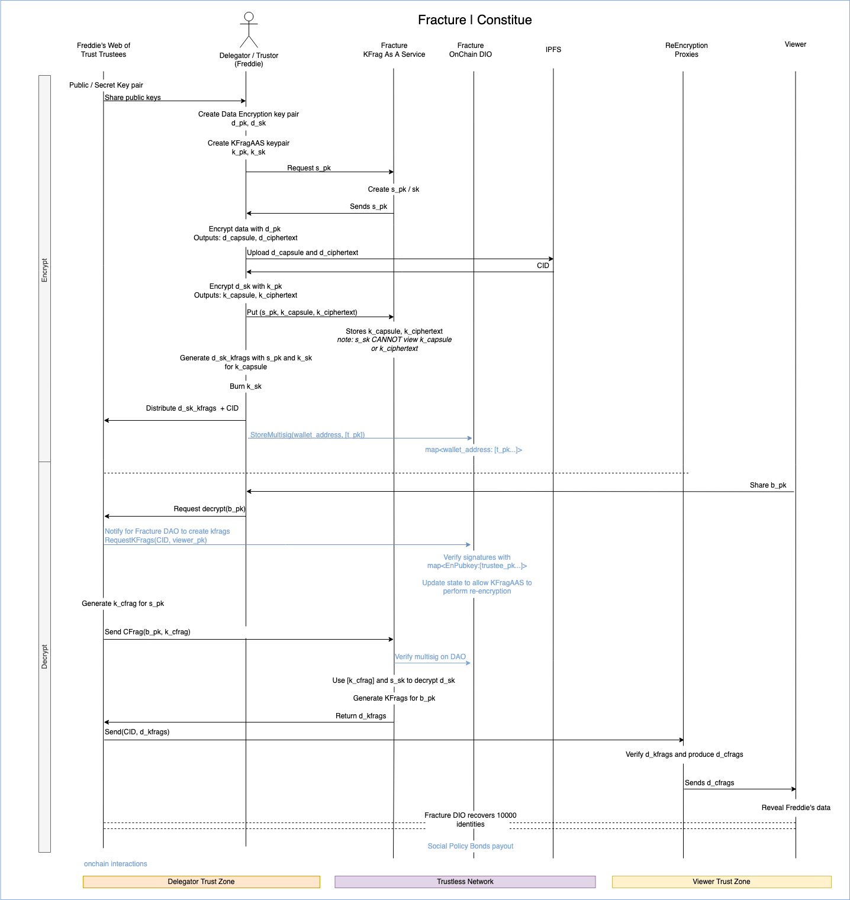

# Current Focus

## Fracture | Constitute

### Objectives

1. Allow users to store encrypted data, not yet knowing who the recipient will be
2. Ensure that no sole intermediary has the ability to decrypt the data, nor will they obtain the un-encrypted data
3. Provide all of the above services in a decentralized network that performs un-trusted operations

Our technologies showcase proof-of-concepts for both sides of the
encryption / decryption flows.

- [Fracture] - implements the Umbral proxy re-encryption scheme
- [Constitute] - provides a user-friendly approach that abstracts away most
- [FractureDAO] - Algorand Multi-sig and DAO smart contracts

[fracture]: https://github.com/fracture-labs/fracture
[constitute]: https://github.com/fracture-labs/constitute
[fracturedao]: https://github.com/fracture-labs/fracturedao

### Applications

#### Document Recovery via Social Consensus

The UNHCR [estimates] that 84 million people are forcibly displaced globally to escape war,
persecution or violence. In many cases, it is unsafe to travel with any identification document,
to ensure their protection when they finally arrive in a destination State, they are often
[registered] by States or NGOs.

We want to provide an option for the forcibly displaced to recover their identity or any data
that they may want to have from their home country without having to carry it on their journey.

#### Process

#### Other applications

Since the design of the solution, we have found that use cases for this solution are much more
than expected.

Humans have positions:

- Geographic positions
- Financial positions
- Political positions

Our positions can change suddenly, leaving us with no choice but to travel. Sometimes you can’t
take your documents with you when it’s time to go, and sometimes you won’t take your documents
with you. Sometimes you end up in places where others can’t follow. When all seems lost, all
that’s often left are the relationships with the people we trust. Let’s leverage this fact to
help people recover after they or their loved ones are forced to travel.

- Relocation, forced
- Natural disaster
- Forcibly displaced
- Protests / political dissidents
- Evacuation
- Heath Care documentation
- Last Will + Testaments

[registered]: https://www.unhcr.org/registration.html
[estimates]: https://www.unhcr.org/refugee-statistics/
